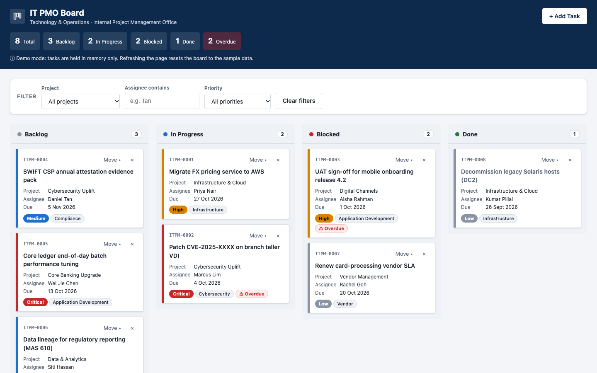

# IT PMO Kanban Board

[](https://github.com/sameerumralkar/Kanban/actions/workflows/ci.yml)

A lightweight Kanban board for the internal IT Project Management Office of a fictitious bank. It's built as a single, dependency-free HTML file.

**Live demo:**
- **v2 (current):** https://sameerumralkar.github.io/Kanban/v2/
- **v1 (original):** https://sameerumralkar.github.io/Kanban/



## Features

- **Four-column board:** Backlog, In Progress, Blocked, Done.
- **Drag and drop** cards between columns. There's also a keyboard-accessible "Move ▸" menu.
- **Add Task** modal with inline validation (project, category, priority, status, due date).
- **Filters** by project and priority. Column badges show `shown/total` while a filter is on.
- **Overdue highlighting** for tasks past their due date that aren't Done.
- **Inline delete confirmation.** There are no browser `alert()`/`confirm()` popups.
- **Email notification** for each new task, sent through [FormSubmit](https://formsubmit.co). This is optional and the board works without it.
- **Responsive layout:** 1 column on phones, 2 on tablets, 4 on desktop.
- **Accessible:** ARIA labels, focus restore after re-render, and priority shown as text as well as colour.

## What's new in v2

`v2/index.html` is a redesign that sits alongside v1. v1 at the site root is unchanged.

- **Delivery timeline:** every task's due date, grouped by project. A runway bar runs from today to the due date. Overdue open tasks get a hatched red bar showing how late they are, with the status and days stated in text.
- **Tasks by status:** a donut chart with a legend that gives the count and share of each column.
- **Tasks by assignee:** horizontal bars, sorted by workload and stacked by status, with overdue counts.
- **Footer** with section links, a link back to v1 and the repository.
- **One status colour language** shared by the columns, charts and timeline. The timeline and charts follow the filters and update on every card move.
- A plain-language headline summary, dark-mode support, and 14 seed tasks (up from 8) so the per-assignee chart has something to compare.

## Tech stack

Vanilla HTML, CSS and JavaScript in one file (`index.html`). There are no frameworks, build step, npm packages or external resources.

## Getting started

```bash
git clone https://github.com/sameerumralkar/Kanban.git
cd Kanban
open index.html            # or double-click it
```

To serve it over HTTP instead:

```bash
python3 -m http.server 8000 --bind 127.0.0.1
# then open http://127.0.0.1:8000/index.html
```

### Email notifications (optional)

Set your address in `FORMSUBMIT_ENDPOINT` at the top of the `<script>` block in `index.html`:

```js
const FORMSUBMIT_ENDPOINT = "https://formsubmit.co/ajax/you@example.com";
```

FormSubmit sends a one-time activation email on the first submission. Nothing is delivered until you click that link.

> **Note:** The board has no persistence by design. Refreshing the page resets it to the seed data.

## Project structure

```
.
├── index.html               # v1: the whole app (markup, <style>, <script>)
├── v2/index.html            # v2: redesign with timeline, charts and footer
├── CLAUDE.md                # Architecture notes and constraints for contributors / Claude Code
├── docs/screenshot.png      # README screenshot of the live site
└── .github/workflows/ci.yml # CI checks + GitHub Pages deployment
```

## CI/CD

Every push and pull request to `main` runs:

1. **Constraint check** (v1 and v2): no storage APIs, `alert`/`confirm`, `!important` or external resources.
2. **JavaScript syntax check** of the inline script.
3. **Secret scan** with [gitleaks](https://github.com/gitleaks/gitleaks).

Pushes to `main` that pass all three checks are deployed to GitHub Pages automatically. v1 is served at the site root and v2 at `/v2/`.

## License

No license has been chosen yet. All rights reserved by the author.
